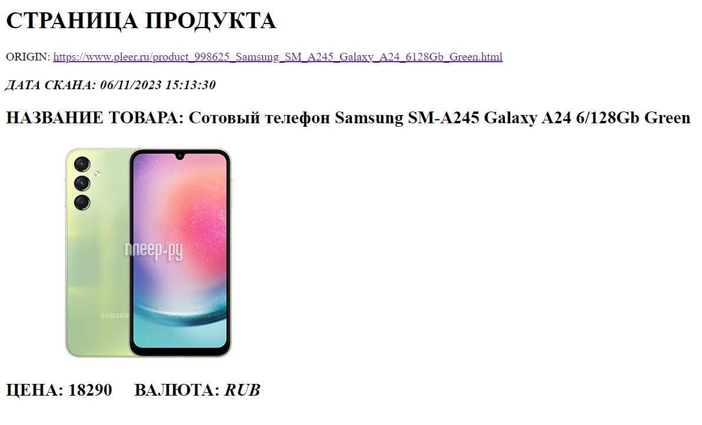

# priceva-test | Получите цену в один клик

# Запуск
1. Клонируем репу:
    ```bash
    git clone git@github.com:aidbull/priceva-test.git
    
2. Запускаем образ контейнера:
    ```bash
   docker-compose up --build

3. Переходим по ссылке:
   [localhost](http://localhost:8080/index.php)http://localhost:8080/index.php

4. Вводим url с товаром pleer.ru:
    * https://www.pleer.ru/product_990896_Braun_SES_5_810.html
    * https://www.pleer.ru/product_998625_Samsung_SM_A245_Galaxy_A24_6128Gb_Green.html

5. Получаем результат парсинга.
   